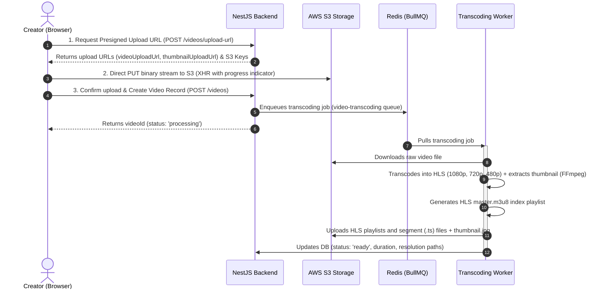

# StreamHub Architecture Overview

StreamHub is a next-generation video streaming and live-broadcasting platform. This document outlines the current backend and frontend architecture for **Video Upload/Transcoding**, **Playback**, and **Live Streaming**.

---

## 1. Video Upload & Transcoding Architecture
The system uses a secure, decentralized upload strategy where the client uploads files directly to AWS S3, and the NestJS backend handles processing asynchronously.



### Key Components:
- **`videos.controller.ts`**: Exposes `/videos/upload-url` (presigned URL request) and `/videos` (upload confirmation/create).
- **`video-processing.service.ts`**: Enqueues jobs using **BullMQ** (backed by Redis) with exponential backoff and retry settings.
- **`video.processor.ts`**: A dedicated queue worker using `spawn(ffmpeg)` to scale and pad outputs to standard sizes (1080p, 720p, 480p), output HLS playlists, generate a unified `master.m3u8`, and upload them back to S3.

---

## 2. Secure Playback Architecture (HLS Proxy)
To prevent public exposure of raw S3 buckets and secure content playback, the system proxies HLS manifest retrieval.

```
                  +-----------------------+
                  |    Client Player      |
                  |     (HlsPlayer)       |
                  +-----------+-----------+
                              |
                     Requests master.m3u8
                              |
                              v
                  +-----------+-----------+
                  |    NestJS Backend     |
                  |  (PlaybackController) |
                  +-----------+-----------+
                              |
               Downloads master.m3u8 from S3
               Rewrites internal relative URLs
               to point back to the NestJS proxy
                              |
                              v
                  +-----------+-----------+
                  |      AWS S3           |
                  +-----------------------+
```

### Key Details:
1. **Playlist proxying (`master.m3u8` & `index.m3u8`)**: The client requests playback via `GET /videos/:id/playback/master.m3u8`. The backend downloads the playlist from S3, parses it, and rewrites all segment/playlist URLs to route back through the backend (e.g. `/videos/:id/playback/hls/...`).
2. **Segment redirects (`.ts` files)**: When the client player requests segment files, the backend redirects them dynamically using highly transient **signed S3 URLs** (`302 redirect`). This keeps the S3 bucket private while offloading high-bandwidth media transfer directly to S3/CloudFront.

---

## 3. Live Streaming Architecture
StreamHub supports two parallel methods of live streaming: **WebRTC Peer-to-Peer** (signaled via WebSockets) and **RTMP Ingestion** (via MediaMTX).

### A. RTMP Ingest & Webhooks (MediaMTX)
Perfect for professional broadcasters using software like OBS Studio.

- **Ingest**: The broadcaster streams to `rtmp://localhost:1935/live/{streamKey}?key={streamKey}`.
- **Authentication (`runOnPublish`)**: MediaMTX is configured via `mediamtx.yml` to call a NestJS API webhook (`POST /v1/live/webhook/on-publish`). The backend validates the stream key (e.g., against user data).
- **Termination (`runOnPublishDone`)**: MediaMTX triggers `on-publish-done` to allow the backend to update stream records and trigger VOD archives.
- **Playback**: MediaMTX automatically packages the incoming stream into HLS, served at `http://localhost:8888/live/{streamKey}/index.m3u8`.

### B. WebRTC Peer-to-Peer & WebSockets
Ideal for fast browser-to-browser streaming without external streaming tools.

- **Signaling Gateway (`live.gateway.ts`)**: Built with NestJS WebSockets/Socket.io under the `/live` namespace, backed by Redis for multi-instance scaling.
- **Connection Handshake**:
  - The broadcaster registers as `registerBroadcaster`.
  - Viewers join the room using `joinRoom`.
  - The gateway relays WebRTC signaling messages (`webrtc-offer`, `webrtc-answer`, `webrtc-ice`) between the broadcaster and the viewers.
  - Live chat and real-time viewer counts are synchronized across all connected room members.

### C. LiveKit Integration (`livekit.service.ts`)
For production-grade WebRTC SFU streaming, the codebase includes a LiveKit client and token generation service. LiveKit enables low-latency publishing and subscribing without overloading a single peer.

---

## 4. Frontend Showcase Integration
The frontend matches the premium backend architecture by providing a unified interface:
- **`VideoPlayer.tsx`**: A smart controller that polls the backend status API. If the status is `processing`, it shows a loading spinner; if `live`, it mounts the `WebRTCViewer`; if `ready`, it mounts `HlsPlayer` to render video via `hls.js`.
- **`ChatPanel.tsx`**: Connects directly to the NestJS Socket.io gateway to provide real-time chat overlays during live streams.
- **`UploadProvider` (`UploadContext.tsx`)**: Orchestrates the multi-phase upload client state, triggering progress indicators from pre-signing and S3 transfer to final backend confirmation.
